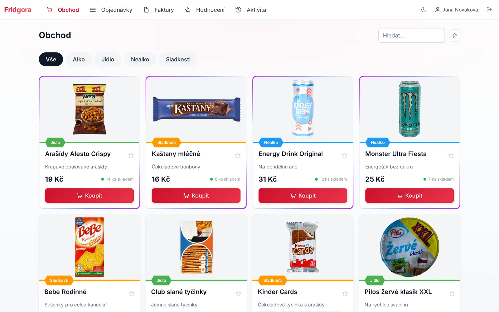
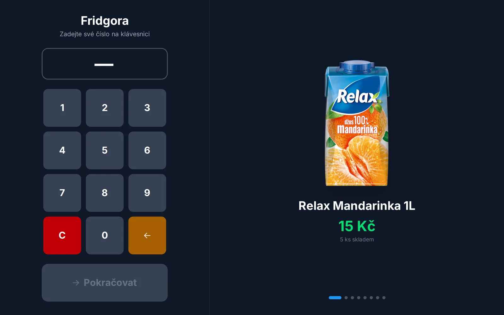
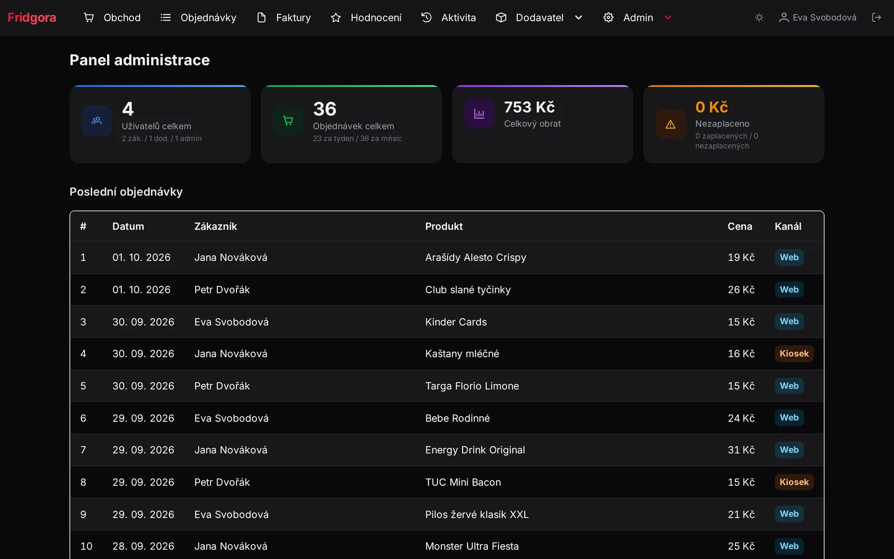
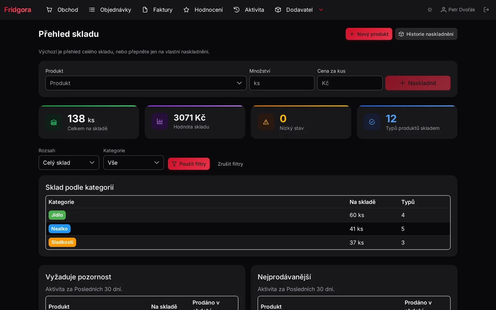
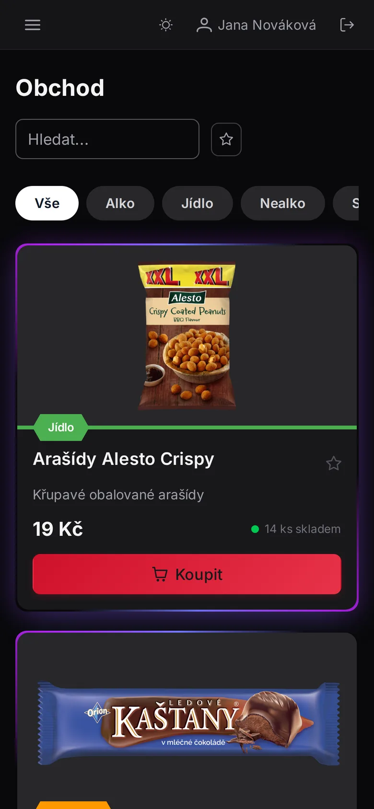

<p align="center">
  
</p>

<h1 align="center">Fridgora</h1>

<p align="center">
  <strong>The office fridge, run like a tiny shop — at cost, with no cash box and no spreadsheet.</strong><br />
  Colleagues grab a drink, tap <em>Buy</em> and settle up later with a QR bank transfer.
</p>

<p align="center">
  <a href="https://github.com/houby-studio/fridgora/actions/workflows/quality.yml"></a>
  <a href="https://github.com/houby-studio/fridgora/releases/latest"></a>
  <a href="https://hub.docker.com/r/houbystudio/fridgora"></a>
  <a href="docs/deployment.md#verifying-an-image"></a>
  <a href="LICENSE"></a>
  
</p>

<p align="center">
  <a href="#-quick-start">Quick start</a> ·
  <a href="#-features">Features</a> ·
  <a href="#-documentation">Docs</a> ·
  <a href="#-development">Development</a> ·
  <a href="CONTRIBUTING.md">Contributing</a>
</p>

<p align="center">
  <picture>
    <source media="(prefers-color-scheme: dark)" srcset="docs/screenshots/shop-dark.webp" />
    
  </picture>
</p>

---

## Why Fridgora?

Every office has one: a fridge full of drinks and snacks that _someone_ buys, and a jar or a
spreadsheet that never quite adds up. Fridgora replaces both.

1. **📦 A supplier stocks it.** Anyone with the supplier role adds a delivery — 24 cans at 15 Kč
   each — and the products appear in the shop.
2. **🛒 Colleagues buy in one click.** On the web, on a phone, or at a touchscreen kiosk next to the
   fridge. Every purchase is recorded against the person and the exact lot it came from.
3. **💸 Everyone pays later.** Purchases roll up into invoices with a QR code for an instant bank
   transfer. The supplier confirms the payment, reminders chase whatever is left.

No profit, no markup, no arguing about who owes what. It started as the fridge of an IT
department in Czechia, where it still keeps the drinks cold and the accounts straight.

> **Fridge + agora** — the square where people meet and trade. Formerly known as
> _Small Business Fridge_.

## ✨ Features

**For colleagues**

- One-click buying with categories, search, favourites, ratings and recommendations
- Order history and invoices with a **QR bank-transfer code** (Czech SPAYD), paid in seconds
- Allergen labels — hide everything you cannot eat
- Email receipts, daily summaries and payment reminders, all optional
- Light and dark mode, Czech and English, installable as a PWA

**For suppliers**

- Products, stock and deliveries, with a stock overview by category and best sellers
- Strict **first-in, first-out** stock across every channel, and a guard that never charges a
  price the buyer was not shown
- Delivery corrections — fix a mistyped amount or price, void a duplicate — with a required
  reason, an audit trail and emails to affected buyers (issued invoices never change)
- Product image pipeline: upload, paste, link or look up by EAN, with background removal,
  trimming and a uniform format ([details](docs/product-images.md))
- Optionally give back to [Open Food Facts](https://world.openfoodfacts.org): suppliers can
  share a product's EAN, name and their own photo with one tick
  ([details](docs/product-images.md#contributing-back-to-open-food-facts))
- Payment approval with grouped, filterable invoices

**For admins**

- Users, roles, invitations and one-time registration links
- Full **audit log** — every change says who did it, from which channel
- Impersonation for support, anonymisation for leavers
- Single sign-on with **Microsoft Entra ID** or Discord, or local accounts — or both

**At the fridge**

- A touchscreen **kiosk**: type your number on the keypad, pick a product or scan its barcode, done
- A ready-made [Electron kiosk client](electron-kiosk/) packaged as a snap for Ubuntu Frame
- Idle screen that cycles through what is in stock, with sounds and music if you want them

**For integrations**

- A documented **REST API** with personal API tokens (OpenAPI, browsable with Scalar)
- An **MCP server** so AI assistants such as Claude can browse the shop, buy, and manage stock
  on your behalf ([docs/mcp.md](docs/mcp.md))

<table>
  <tr>
    <td width="50%"></td>
    <td width="50%"></td>
  </tr>
  <tr>
    <td align="center"><sub>Kiosk next to the fridge</sub></td>
    <td align="center"><sub>Admin dashboard</sub></td>
  </tr>
  <tr>
    <td width="50%"></td>
    <td width="50%" align="center"></td>
  </tr>
  <tr>
    <td align="center"><sub>Supplier stock overview</sub></td>
    <td align="center"><sub>On a phone</sub></td>
  </tr>
</table>

## 🚀 Quick start

All you need is Docker. Images are published only from commits that passed the whole test
suite.

```bash
# 1. Grab the compose file and the environment template
wget https://raw.githubusercontent.com/houby-studio/fridgora/refs/heads/master/compose.yaml
wget https://raw.githubusercontent.com/houby-studio/fridgora/refs/heads/master/.env.example -O .env

# 2. Fill in at least the [REQUIRED] values in .env (APP_KEY, DB_PASSWORD)
#    — the template explains every option

# 3. Start it
docker compose up -d
```

Open <http://localhost:3000> and the first visit walks you through creating the admin account.

**Running it for real?** Read the [deployment guide](docs/deployment.md): Docker secrets, pinning
a version, upgrades and backups. Every image carries a **signed SLSA build provenance**
attestation, so you can prove it was built by this repository's CI before you deploy it:

```bash
gh attestation verify oci://docker.io/houbystudio/fridgora:<version> --repo houby-studio/fridgora
```

## 📚 Documentation

| Guide                                              | What is in it                                                       |
| -------------------------------------------------- | ------------------------------------------------------------------- |
| [Deployment](docs/deployment.md)                   | Production setup, secrets, releases, verifying images, all env vars |
| [Authentication scenarios](docs/auth-scenarios.md) | Local accounts, SSO, invitations and how the env options combine    |
| [MCP server](docs/mcp.md)                          | Connecting Claude and other AI assistants                           |
| [Product images](docs/product-images.md)           | The image pipeline, background removal and Open Food Facts          |
| [Testing reference](docs/testing-reference.md)     | The test suite and how to work with it                              |
| [Migrating from v2](docs/migration-from-v2.md)     | Coming from the old MongoDB-based v2                                |
| [Kiosk client](electron-kiosk/)                    | The Electron kiosk and its snap                                     |

The REST API documents itself: set `SWAGGER_ENABLED=true` and open `/docs`.

## 🛠 Development

```bash
cp .env.example .env
npm install
npm run hooks:install                 # once per clone: repo-tracked git hooks
node ace generate:key
docker compose -f compose.dev.yaml up -d   # PostgreSQL, Mailpit, pgAdmin
export NODE_ENV=development
node ace migration:run
node ace db:seed                      # admin / supplier / customer / kiosk demo users
npm run dev                           # http://localhost:3000
```

Sign in as `admin / admin123`, `supplier / supplier123`, `customer / customer123` or
`kiosk / kiosk123`. Outgoing mail lands in Mailpit at <http://localhost:8025>.

Before you push, run the same gate CI runs — lint, format, types, migrations, unit, functional
and end-to-end tests:

```bash
./check.sh
```

**Built with** [AdonisJS 7](https://adonisjs.com/) on Node.js 24, PostgreSQL 18,
[Vue 3](https://vuejs.org/), [Inertia.js](https://inertiajs.com/) and
[PrimeVue](https://primevue.org/) — TypeScript end to end, tested with
[Japa](https://japa.dev/) and [Playwright](https://playwright.dev/).

## 🤝 Contributing

Ideas, bug reports and pull requests are all welcome — start with an
[issue](https://github.com/houby-studio/fridgora/issues) so we can agree on the approach, then see
[CONTRIBUTING.md](CONTRIBUTING.md). Please follow the [code of conduct](CODE_OF_CONDUCT.md), and
report security issues privately as described in [SECURITY.md](SECURITY.md).

## 📄 License

[MIT](LICENSE) © [Houby Studio](https://github.com/houby-studio) — free to use, change and run
in your own office.
